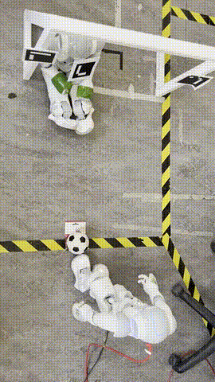

# BioInspiredNao
This repository contains the source code for the project Biologically Inspired Learning for Humanoid Robots 

## Technology
The project is based on the [NAO robot platform](https://www.aldebaran.com/en/nao). Communication with the robot is based 
on ROS. All implementation are done in Python2 (due to limited supporting plaform of ROS). 

## Red Object Tracking and Mirroring Arm Movement
The implementations of this task has been done in multiple steps:
1. The red object tracking is operformed using OpenCV. After preprocessing and detection of red blobs in the input image the center of the largest
 red blob of the image is saved
2. We use the the front head tactile touch button to collect training samples. When touched a new training sample containing the current position of the biggest
   red blob as well as the current states of the shoulder joints (roll and pitch) is added to a list of training samples.  
3. We implemented a multi-layer neuronal network from scratch using only numpy. Using ADAM as an optimizer, we trained this network with the collected training samples.
4. Afterwards, the behaviour of the trained algorithm could be demonstrated

## Decision tree based reinforcement learning

The goal is the reimplementation of the paper: [Generalized model learning for Reinforcement Learning on a humanoid robot](https://ieeexplore.ieee.org/abstract/document/5509181). Using a 1 DOF movement of the left robot leg is combined with a reinforcement learning based reward schema. 

### Goalkeeper position tracking

The goalkeeper position is discretized into three states: left, middle, right. The position is tracked using ArUco markers. These markers are placed at each post as well on the goalkeeper representing nao robot. The position of the nao robot tag relative to the goal post tags is then used to get the discretized positon of the goalkeeper. The algorithm is implemented using openCV. 

### Decision tree based state transition and reward function 

Following the linked algorithm the transition function as well as the reward function of the reinforcement learning agent are implemented using decision trees. The transtion decision tree represents the relative state change in its outputs. 

### Code
The implementations of the agent can be found in the [rl_agent folder](./rl_agent). 

